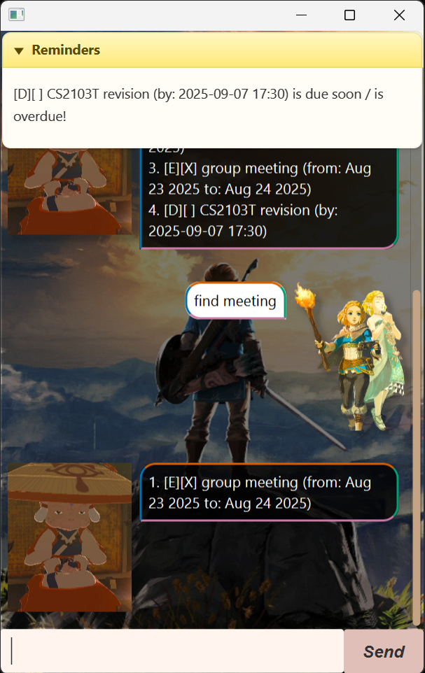

# Sophia User Guide

## Introduction

Sophia is a simple task management chatbot with both command line and graphical user interface (GUI) support.
It helps you keep track of three main types of tasks:

- [ ] To-dos – simple tasks without a date/time.
- [ ] Deadlines – tasks with a due date (and optional time).
- [ ] Events – tasks that span a period of time.

Sophia also supports marking tasks as *done/undone*, deleting tasks, finding tasks by keyword, reminders for *due/overdue* items, and *saving/loading* tasks automatically between sessions.

### Quick Start
1. Run Sophia
    ```java
    java -jar sophia.jar
    ```
2. Type a command into the input box (or console).
3. Press Enter to see Sophia’s reply.
4. Exit anytime with:
    ```text
    bye
    ```
   
## Adding To-dos
Adds a simple task without a date. <br>
Usage: `todo <description>`<br>
Example: `todo read book` <br>
Expected output:    
```text
Got it. I've added this task:
    [T][ ] read book
Now you have 1 task in the list.
```

## Adding Deadlines
Adds a task with a due date (and optional time).<br>
Usage: `deadline <description> /by <yyyy-MM-dd> [HH:mm]`<br>
Examples :
<br>`deadline submit report /by 2025-12-09`<br>
`deadline project demo /by 2025-12-09 23:59`<br>
`deadline thesis draft /by 2025-12-09T23:59   // 'T' also accepted` <br>
Expected output:
```text
Got it. I've added this task:
  [D][ ] submit report (by: Dec 9 2025)
Now you have 2 tasks in the list.   
```

## Adding Events
Adds a task with a start and end date (and optional time).<br>
Usage: `event <description> /from <yyyy-MM-dd> [HH:mm] /to <yyyy-MM-dd> [HH:mm]`<br>
Examples :
<br>`event team meeting /from 2025-12-10 /to 2025-12-12`<br>
`event conference /from 2025-12-10 09:00 /to 2025-12-12 17:00`<br>
`event workshop /from 2025-12-10T09:00 /to 2025-12-12T17:00
` <br>
Expected output:
```text
Got it. I've added this task:
  [E][ ] conference (from: Dec 10 2025, 09:00 to: Dec 12 2025, 17:00)
Now you have 3 tasks in the list.
```

## List Tasks
Shows all tasks currently in the task list. <br>
Usage: `list`<br>
Expected output:
```text
Here are the tasks in your list:
1.[T][ ] read book
2.[D][ ] submit report (by: Dec 9 2025)
3.[E][ ] conference (from: Dec 10 2025, 09:00 to: Dec 12 2025, 17:00)
```
## Marking & Unmarking Tasks
Marks a task as done or undone. <br>
Usage: `mark <index>` or `unmark <index>`<br>
Example: `mark 1`<br>
Expected output:
```text
Nice! I've marked this task as done:
  [T][X] read book
```
## Deleting Tasks
Marks a task as done or undone. <br>
Usage: `delete <index>`<br>
Example: `delete 2`<br>
Expected output:
```text
Noted. I've removed this task:
  [D][ ] submit report (by: Dec 9 2025)
Now you have 2 tasks in the list.
```
## Finding Tasks
Searches for tasks whose descriptions contain a keyword. <br>
Usage: `find <keyword>`<br>
Example: `find book`<br>
Expected output:
```text
Here are the matching tasks in your list:
1.[T][ ] read book
```
## Reminders
Shows tasks that are due soon or overdue. <br>
Usage: Reminder box is always at the top of the anchor pane. Click the arrow button to toggle reminder box. 
Reminders are updated whenever tasks are updated/added/deleted. <br>
Expected output:
```text
Reminder: The following tasks are due soon / overdue:
[D][ ] submit report (by: Dec 9 2025) is due soon / is overdue!
```
## Saving tasks
Task data is saved to a text file (default: data/sophia.txt) <br>
Usage: `save` <br>
Expected output:
```text
Tasks saved to file
```

## Exit 
Exits the application.
Usage: `bye`
Expected output:
```text
Bye. Hope to see you again soon!
```
